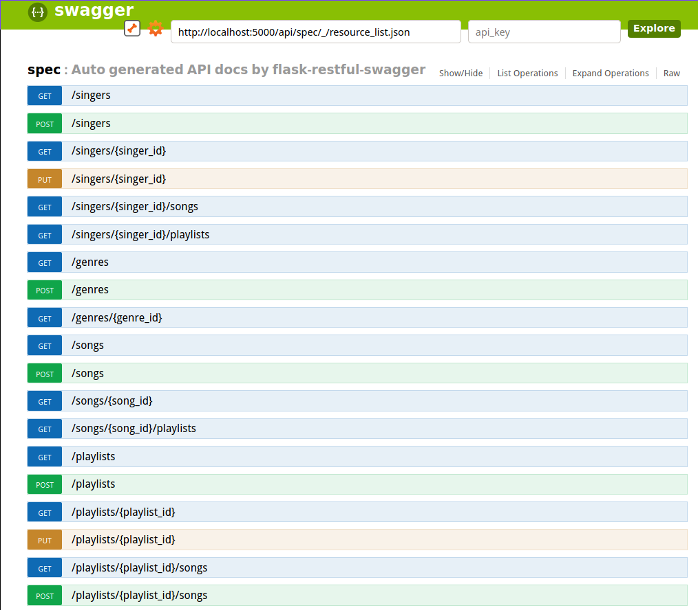
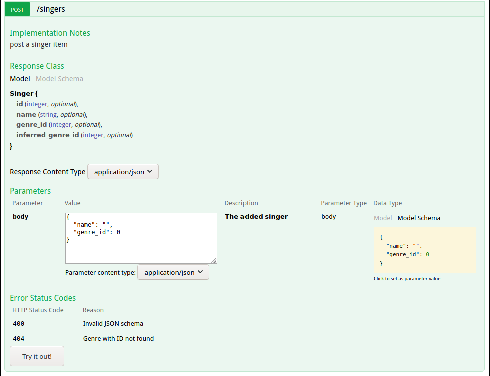

# Genre API
A simple API managing playlist and analysing artists' music genre.

# Requirements
* Docker
* Python3

# Installation and deployment
Setting-up:
```bash
git clone git@github.com:Pikipoo/genre-api.git
cd genre-api
```

Deploy API's container:
```bash
docker build . -t genre_api:1.0
docker run --name genre_api -p 5000:5000 genre_api:1.0
```

Run the script calculating inferred genres for artists:
```bash
python3 -m genre_api.scripts.calc_inferred_genre
```
Note that this script is meant to be run on a regular basis, and should be scheduled with cron.
# Accessing API's Swagger
The API is documented using Swagger, once the API is running simply access `http://localhost:5000/api/spec.html#!/spec` to find every routes and their usages.



<br/>
Each route is described with its response class and parameters' schemas. You can easily build a query and set a JSON parameter by clicking on the "Model Schema".


